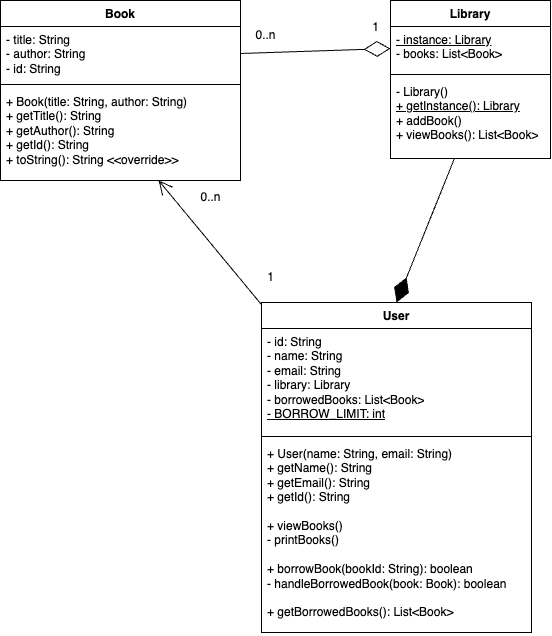

# Library Management System

## Overview
This project is a simple Library Management System implemented in Java using Test-Driven Development (TDD). It allows users to view books in the library.

## Features
- View books in the library
- Add books to the library
- Each book has a unique ID

## Architectural Decisions
- Used OOP principles to model the `Book` and `Library` classes.
- `Library` maintains a list of books and exposes a method to view them.
- Used `unmodifiableList` to ensure immutability when retrieving book data.
- Followed TDD by writing unit tests before implementation.
- Each book has a unique identifier (`UUID`) for tracking.

## Assumptions
- The library starts empty.
- Books have a title, an author, and a unique ID.

## Class Diagram


### Demo run

```
/Library/Java/JavaVirtualMachines/amazon-corretto-17.jdk/Contents/Home/bin/java -javaagent:/Applications/IntelliJ IDEA.app/Contents/lib/idea_rt.jar=51019:/Applications/IntelliJ IDEA.app/Contents/bin -Dfile.encoding=UTF-8 -classpath /Users/pochasri/temp/LibraryManagement/target/classes LibraryDemo
Library is empty
Books in the library:
Book{id='420e051c-8569-4015-bb1c-edf795af995e', title='The Great Gatsby', author='F. Scott Fitzgerald'}
Book{id='e96baafb-ec2e-4cb7-ad9c-4237f8be8a30', title='To Kill a Mockingbird', author='Harper Lee'}
Book{id='189026ec-dfe0-4717-8a06-e9a868907463', title='1984', author='George Orwell'}

Process finished with exit code 0
```